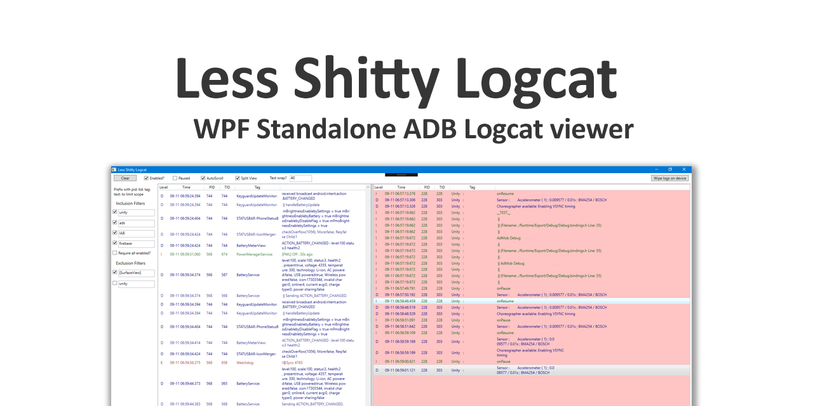

# Less Shitty Logcat
	
	A lightweight, standalone ADB logcat viewer, using WPF
	Especially useful for Unity development with many plugins and for 
	(e.g.) Samsung devices with the once-per-frame log spam.
		
	github.com/JonathanDotCel
		
	Features:
		
		Multiple Filters (And/Or)
		 e.g. "Unity" or "Ads" or "Billing" (without resorting to regex)
		 e.g. "Unity" and "pid:748"
		 e.g. exclude [SurfaceView]
		
		Side by Side view with separate buffers
		 View filtered and unfiltered logs at the same time. Separate buffers.
		 The thing you're focused on won't scroll off screen due to random background noise.
		
		Exclusion filters
		 Takes effect before even hitting the filtered/unfiltered buffers. Tranquil.
		
		Pause
		 Leave the logcat connection open, but queue up messages while you catch your breath, 
		 search StackOverflow, etc.
		
		Autoscroll that works... and Scroll Lock that works!
		 Jerk-free scrolling without scroll lock constantly re-enabling itsself. 		 
		 Smooth scrolling and perfectly steady focus on a single message, even while earlier 
		 messages are being purged.		 
		 And no wrestling to take control of the scroll bar.
		 (Looking at you, eclipse)
		
		Log Grouping
		 E.g. when a thread sends 2 or more messages with the same timestamp, like Unity stack traces.
		 
		Text Wrap in a single list item
		 It's not split over a bunch of different lines.
		 
		Limit buffers by item count
		 Why should you know/care how much (e.g.) 100mb gets you. Define it by count.
		
		C#
		 Easy street getting it open in VS2017 and jumping right in. No external deps. Except ADB.
		 
	Todo / Limitations:
		
		Unfortunately I've had only 2 days to write this initial version so it'll need 
		some love and attention going forward.
		
		- Copypasta
		- Limit by Level (Assert/Debug/Warn/Info, etc)
		- Save user settings.
	
